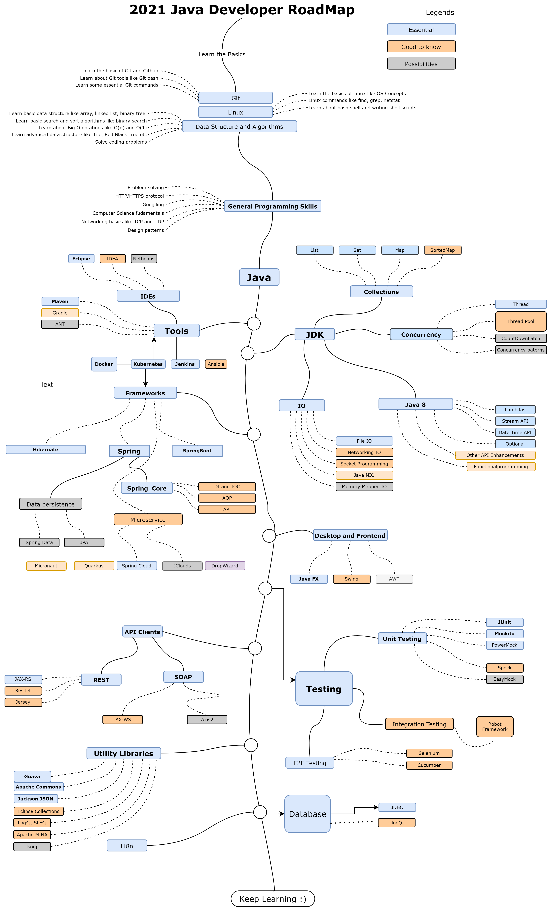

# 2021 Java RoadMap

## Mandatory skill for any Java developers 

Now, let’s go through this Java developer RoadMap step by step and find out how you can learn the essential skills requires to become a Java Developer in 2021:

### **1. Git & Github** 

One of the most popular version control systems. It’s just not possible to live without Git anymore. As a programmer, you should be familiar with Git and Github, essential Git concepts like a branch, master, checkout, checking, push and pull, as well essential git commands like git diff, git commit, etc.

I highly recommend Java programmers to learn Git and Github and if you already worked with Git then you can also level up your Git skills and If you need a resource then you can check out [**The Git Complete Guide**](https://click.linksynergy.com/deeplink?id=JVFxdTr9V80&mid=39197&murl=https%3A%2F%2Fwww.udemy.com%2Fgit-complete%2F) on Udemy to start with.[Git Complete Full Course: The Definitive Guide to GitGit Complete This course is designed to be a comprehensive approach to Git, which means no prior knowledge or…udemy.com](https://click.linksynergy.com/deeplink?id=JVFxdTr9V80&mid=39197&murl=https%3A%2F%2Fwww.udemy.com%2Fgit-complete%2F)

### **2. Linux** 

Not just a web developer but for any programmer, the Linux command line is very, very important, and I strongly recommend you to spend some time learning them. Since most Java applications are server-side, you will often find them running on Linux servers.

That’s why it's imperative for Java developers to be familiar with essential Linux concepts and commands related to files, disk space checking, process management, as well as networking commands.

If you need a resource to level up your Linux skills, I recommend checking out [**Linux Mastery: Master the Linux Command Line in 11.5 Hours** ](https://click.linksynergy.com/deeplink?id=CuIbQrBnhiw&mid=39197&murl=https%3A%2F%2Fwww.udemy.com%2Fcourse%2Flinux-mastery%2F)course on Udemy. This is a great course for anyone who wants to learn Linux commands from scratch.[Linux Mastery: Mastering the Linux Command LineTESTIMONIALS =============================== " Best course on Linux on Udemy so far, I definitely do recommend" …udemy.com](https://click.linksynergy.com/deeplink?id=CuIbQrBnhiw&mid=39197&murl=https%3A%2F%2Fwww.udemy.com%2Fcourse%2Flinux-mastery%2F)

If you need more resources then you can use these [free Linux courses](http://www.java67.com/2018/02/5-free-linux-unix-courses-for-programmers-learn-online.html) to start learning Linux.

### 3. **Data Structures and Algorithms** 

These are the building blocks of any program, and a good knowledge of Algorithms and Data Structure is vital for your next job or doing well in your current situation.

You should at least be familiar with essential data structures like an array, linked list, hash table, binary tree, queue, stack, and graph as well problem-solving techniques like dynamic programming.

If you know advanced data structures like Trie, B-Tree, AVL tree, then it’s well and good. But, if you don’t know, then I suggest you join a comprehensive course like [**Data Structures and Algorithms: Deep Dive Using Java**](https://click.linksynergy.com/fs-bin/click?id=JVFxdTr9V80&subid=0&offerid=323058.1&type=10&tmpid=14538&RD_PARM1=https%3A%2F%2Fwww.udemy.com%2Fdata-structures-and-algorithms-deep-dive-using-java%2F), which will teach you everything about all those fundamentals.[Data Structures and Algorithms: Deep Dive Using JavaTim's been a professional software developer for over 35 years. During his career, he has worked for major companies…udemy.com](https://click.linksynergy.com/fs-bin/click?id=JVFxdTr9V80&subid=0&offerid=323058.1&type=10&tmpid=14538&RD_PARM1=https%3A%2F%2Fwww.udemy.com%2Fdata-structures-and-algorithms-deep-dive-using-java%2F)

### **4. HTTP / HTTPS** 

The HTTP protocol is the backbone of the web, and a good knowledge of both HTTP and HTTPS is mandatory for a web developer. At least you should know about how HTTP works and what are different HTTP methods and their purposes etc.

### 5**. Computer Science Fundamentals** 

If you are creating global applications that show information in many different languages across the world, then you should have a good knowledge of character encodings.

It basically tells your browser how to show your data. If you want to learn more about Computer Science, you can also check out Computer Science 101: Master the Theory Behind Programming course on Udemy.[Computer Science Theories 101: Theory Behind ProgrammingI am a self-taught multi-media designer and computer scientist who has helped bring the creative vision of clients all…udemy.com](https://click.linksynergy.com/deeplink?id=CuIbQrBnhiw&mid=39197&murl=https%3A%2F%2Fwww.udemy.com%2Fcourse%2Fcomputer-science-101-master-the-theory-behind-programming%2F)

### 6. SQL 

This is another common tech skill that every Java developer should learn as it will help you to troubleshoot backend issues. If you know SQL you can understand the stored procedure, query database, and find out whether the issue is in the Java layer or Database layer.

I highly recommend every Programming whether a Java developer or a Python developer to learn SQL, it’s one of those skills which are easy to learn and serve you for a long time in your career as a programmer or developer.

If you need a resource, I suggest looking at the [**Complete SQL + Databases Bootcamp: Zero to Mastery** ](https://academy.zerotomastery.io/p/complete-sql-database-bootcamp-zero-to-mastery?affcode=441520_zytgk2dn)course by Andrei Negaoie on ZTM Academy.[Complete SQL + Databases Bootcamp: Zero to Mastery✓ Become an expert in SQL and Database concepts ✓ Add SQL, PostgreSQL, MySQL, Redis, Database Management/Design to your…academy.zerotomastery.io](https://academy.zerotomastery.io/p/complete-sql-database-bootcamp-zero-to-mastery?affcode=441520_zytgk2dn)

### 7**. Design Patterns** 

There is no doubt that every programmer should know Git and Github as they are the standard in terms of version control and code repository. If you want to learn and master Design Patterns, particularly OOP Design patterns then I suggest you join the [**Design Patterns in Java**](https://click.linksynergy.com/deeplink?id=CuIbQrBnhiw&mid=39197&murl=https%3A%2F%2Fwww.udemy.com%2Fcourse%2Fdesign-patterns-java%2F) course by Dmitri Nestruk on Udemy. This is a great course to learn the modern implementation of classic design patterns in Java.[Design Patterns in Java for Engineers, Designers, and ArchitectsThis course provides a comprehensive overview of Design Patterns in Java from a practical perspective.udemy.com](https://click.linksynergy.com/deeplink?id=CuIbQrBnhiw&mid=39197&murl=https%3A%2F%2Fwww.udemy.com%2Fcourse%2Fdesign-patterns-java%2F)

If you need more resources, you can also check out my earlier articles about the best design patterns [books ](https://www.java67.com/2016/10/top-5-object-oriented-analysis-and-design-patterns-book-java.html)and [courses ](https://javarevisited.blogspot.com/2018/02/top-5-java-design-pattern-courses-for-developers.html)to learn Object-Oriented Design patterns in depth.

## The 2021 Java Developer RoadMap 

Now, let’s explore this Java developer roadmap together and find out what tools, frameworks, libraries, APIs, tools, and skills you can learn to become a professional Java developer in 2021.

## 1. Tools 

The tools section is divided into different sections. First, your IDE, which is your primary tool and can do almost everything you asked for like compile, run, debug, profile, test, compare files and code, refactoring, and much more.

### 1.1 IDEs 

For Java Developers, there are two main IDES, [Eclipse](https://medium.com/javarevisited/6-free-best-eclipse-ide-courses-for-java-programmers-1229ee9e5d87) and [IntelliJIDEA](https://medium.com/javarevisited/7-best-courses-to-learn-intellij-idea-for-beginners-and-experienced-java-programmers-2e9aa9bb0c05), you can choose any one of them as I have used Eclipse most in my life but I am currently working in IntelliJIDEA so I love both of them, but most of the Java developer I know they work in IDEA.

I suggest you master IDEA shortcuts, views, and all other features it offers to become a true Java Master and if you need a resource, I think [**IntelliJ IDEA Tricks to Boost Productivity for Java Devs**](https://click.linksynergy.com/deeplink?id=CuIbQrBnhiw&mid=39197&murl=https%3A%2F%2Fwww.udemy.com%2Fcourse%2Fintellij-idea-secrets-double-your-coding-speed-in-2-hours%2F) is a great place to start with.[IntelliJ IDEA Tricks to Boost Productivity for Java DevsIf you want to become a real pro Java programmer, you need to master your keyboard and IntelliJ IDEA. You need to be…udemy.com](https://click.linksynergy.com/deeplink?id=CuIbQrBnhiw&mid=39197&murl=https%3A%2F%2Fwww.udemy.com%2Fcourse%2Fintellij-idea-secrets-double-your-coding-speed-in-2-hours%2F)

### 1.2 Build Tools 

The second part is the build tool, which you need to build and deploy your projects like [Maven](https://medium.com/javarevisited/top-10-free-courses-to-learn-maven-jenkins-and-docker-for-java-developers-51fa7a1e66f6) and [Gradle](https://medium.com/javarevisited/5-best-gradle-courses-and-books-to-learn-in-2021-93f49ce8ff8e). Any one of these would be enough. I have just listed ANT, but that’s for legacy projects. For all new Java projects, prefer Gradle, it's much more concise than Maven.

If you want to learn both Maven and Gradle, there are not many resources available. If you ask me, I recommend [**Apache Maven: Beginner to Guru**](https://click.linksynergy.com/deeplink?id=CuIbQrBnhiw&mid=39197&murl=https%3A%2F%2Fwww.udemy.com%2Fcourse%2Fapache-maven-beginner-to-guru%2F) by John Thompson on Udemy.[Apache Maven: Beginner to Guru for Java and Spring Boot AppsApache Maven is the most popular Java build tool. Companies and Open Source communities around the world, consider…udemy.com](https://click.linksynergy.com/deeplink?id=CuIbQrBnhiw&mid=39197&murl=https%3A%2F%2Fwww.udemy.com%2Fcourse%2Fapache-maven-beginner-to-guru%2F)

And, if you are keen to learn Gradle, I suggest you check out [**Gradle for Java Developers** ](https://click.linksynergy.com/deeplink?id=CuIbQrBnhiw&mid=39197&murl=https%3A%2F%2Fwww.udemy.com%2Fcourse%2Fgradle-for-java-developers%2F)by another great UDemy instructor, Bharat Thippireddy.[Gradle for java developersSample Reviews: Course is certainly very informative and the fundamentals are well explained with real world examples…udemy.com](https://click.linksynergy.com/deeplink?id=CuIbQrBnhiw&mid=39197&murl=https%3A%2F%2Fwww.udemy.com%2Fcourse%2Fgradle-for-java-developers%2F)

### 1.3 Containers and DevOps Tools 

And, the third and most crucial part includes containers like **Docker and Kubernetes**, CI/CD tools like [Jenkins ](https://medium.com/javarevisited/7-best-courses-to-learn-jenkins-and-ci-cd-for-devops-engineers-and-software-developers-df2de8fe38f3?source=---------15------------------)and TeamCity, and Infrastructure automation tools like [Ansible](https://medium.com/javarevisited/5-best-ansible-courses-for-devops-engineers-cc87692fdf52).

Out of these Docker is the most important because it makes it easy to set up your development environment as well as it also makes the Deployment of Java Microservices easier.

Kubernetes is a next-level tool and not really needed for all JAva developers, particularly if you are not in DevOps and managing things like scaling and deployment but it's good to know from a knowledge perspective.

I suggest having good knowledge of Docker and basic knowledge of Kubernetes for Java developers and if you need resources, I recommend Maximillian SchwaurzMuller’s [**Docker & Kubernetes: The Practical Guide**](https://click.linksynergy.com/deeplink?id=CuIbQrBnhiw&mid=39197&murl=https%3A%2F%2Fwww.udemy.com%2Fcourse%2Fdocker-kubernetes-the-practical-guide%2F) course on Udemy. You can learn both of these tools in one course.[Docker & Kubernetes: The Practical GuideStarting out at the age of 13 I never stopped learning new programming skills and languages. Early I started creating…udemy.com](https://click.linksynergy.com/deeplink?id=CuIbQrBnhiw&mid=39197&murl=https%3A%2F%2Fwww.udemy.com%2Fcourse%2Fdocker-kubernetes-the-practical-guide%2F)

If you are interested in learning about these tools, here are some useful courses to learn to build tools and IDEs

## 2. Java APIs 

The next important thing to learn is JDK APIs, which are very, very important for any Java developer. This is quite a big section, and that’s why it’s divided into core areas like [Java Collections framework](https://medium.com/javarevisited/7-best-java-collections-and-stream-api-courses-for-beginners-in-2020-3ad18d52c38?source=extreme_sidebar---------0-2----------------------), [Java Concurrency](https://medium.com/javarevisited/8-best-multithreading-and-concurrency-courses-for-experienced-java-developers-8acfd3b25094), Java IO, and Java 8 APIs, let’s explore each of them

### 2.1 Java Collections Framework 

This is one of the most essential Java API every Java developer should learn. This API provides implementations of standard data structure in Java-like linked list, set, stack, queue, hash table, priority queue, and others.

At least you should know about all everyday objects like `ArrayList`, `HashMap`, `HashSet`, `LinkedHashSet`, `TreeSet`, etc. Each of them has its different property like ArrayList is a dynamic array that can grow, HashMap is a standard implementation of the hash table and can be used to store key-value pairs.

Similarly, `HashSet` is a set implementation that doesn’t allow duplicate elements. I strongly suggest you check [**Java Fundamentals: Collections** ](https://pluralsight.pxf.io/c/1193463/424552/7490?u=https%3A%2F%2Fwww.pluralsight.com%2Fcourses%2Fjava-fundamentals-collections)course by Richard Warburton on Pluralsight to learn Java Collection Framework in depth.

### 2.2 Java Concurrency 

After Java Collections, the next, most crucial API in Java is about multithreading and concurrency, and I firmly believe that if you want to be a competent Java developer, you must have a solid understanding and command of Java Concurrency API.

You should not only have an in-depth understanding of fundamental concepts like `Thread`, `Runnable`, Object locking, and Synchronization, but you should also be familiar with concepts like deadlock, livelock, race conditions, and how to deal with them.

You should also learn about advanced Java concepts like synchronizers added on Java 5 and subsequent versions, I mean `CyclicBarrier`, `CountDownLatch`, `Phaser`, and `CompleteableFuture`, etc., along with Futures and how to perform the async operation in Java.

I know, it’s a lot of stuff, and that’s why I suggest you join an in-depth course like [**Java Concurrency in Practice bundle**](https://learning.javaspecialists.eu/courses/concurrency-in-practice-bundle?affcode=92815_johrd7r8) from Heinz Kabutz, a Java Champion, and authority when it comes to concurrency and design patterns. This course is a bit expensive, but you will learn a lot more concepts in-depth, which makes it completely worth your time and money.

On the other hand, if the price is an issue, you can also check this Udemy course — [**Concurrency, Multithreading, and Parallel Computing in Java**](https://click.linksynergy.com/deeplink?id=CuIbQrBnhiw&mid=39197&murl=https%3A%2F%2Fwww.udemy.com%2Fcourse%2Fmultithreading-and-parallel-computing-in-java%2F) which won’t cost you more than $10 if you get it on Udemy flash sales which happens every month. This is also an excellent course to learn Java concurrency and multithreading in Java.[Concurrency, Multithreading and Parallel Computing in JavaThis course is about the basics of multithreading and concurrent programming with some parallel concepts. In the 21st…udemy.com](https://click.linksynergy.com/deeplink?id=CuIbQrBnhiw&mid=39197&murl=https%3A%2F%2Fwww.udemy.com%2Fcourse%2Fmultithreading-and-parallel-computing-in-java%2F)

### 2.3 Java IO 

I have interviewed more than 100+ Java programmers, and I have noticed one pattern; they all have very little knowledge of Java IO and NIO APIs as compared to Java Collections and Java Multithreading API. I can understand that many people spend a lot of time learning those two APIs, but you cannot leave behind these critical APIs.

If you have to code a real-world, core Java application, you will need to use classes like `File`, `InputStream`, `OutputStream`, `Reader`, `Writer` from the `java.io` package, which is the core of the Java IO API. Similarly, you also need to know about `ByteBuffer`, `FileChannel`, `Selector`, and other critical classes from `java.nio` API, if you want to write a socket-based application.

Unfortunately, there are not many dedicated resources on teaching Java IO and Java NIO API, but [**The Complete Java Masterclass** ](https://click.linksynergy.com/fs-bin/click?id=JVFxdTr9V80&subid=0&offerid=323058.1&type=10&tmpid=14538&RD_PARM1=https%3A%2F%2Fwww.udemy.com%2Fjava-the-complete-java-developer-course%2F)is a great resource to master this API. You will find a lot of essential concepts from this API in this course.

### 2.4 Java 8 Features 

Now, the next and another necessary API, a Java programmer, should learn is the Java 8 features, which has completely changed the way Java is coded and programmed nowadays. To become a Java developer in 2021, you must know how to use a [Lambda expression](https://medium.com/javarevisited/7-best-java-tutorials-and-books-to-learn-lambda-expression-and-stream-api-and-other-features-3083e6038e14?source=---------14------------------), [Stream API](https://medium.com/javarevisited/8-best-lambdas-stream-and-functional-programming-courses-for-java-developers-3d1836a97a1d), Optional classes, and a new Date and Time API.

Without knowing these APIs, it would be very tough to write a Java application in 2021. Most of the libraries also now stop supporting versions lower than Java 8, which means you have to learn Java 8 features now than later. It’s already 5 years since Java 8 was released, so you literally have no excuse left.

When it comes to learning Java 8 features, there are a lot of excellent resources available in the market. Still, if you already know Java, I suggest you choose the resource which only focuses on Java 8 features like the [**Java 8 for Experienced Developers: Lambdas, Stream API & Beyond**](https://www.educative.io/courses/java-8-lambdas-stream-api-beyond?affiliate_id=5073518643380224) course on Educative. This way, you can learn Java 8 in no time.

While Java 8 features are essential for Core Java developers, if you can, please learn all other new features introduced from Java 9 to Java 13 like [**Modules**](https://medium.com/javarevisited/5-courses-to-learn-java-9-features-in-depth-373f7afcf9fa), `var` for local variables, static factory methods for collections, Text Block, String in Switch, and many more. If you need more resources, you can check out this list of courses to [learn all new Java features ](https://medium.com/javarevisited/top-5-courses-to-learn-new-features-of-java-8-to-java-13-107eb51d2a13)in 2021.

## 3. Frameworks 

The best thing about Java is that it has a vibrant ecosystem, which means there are a lot of frameworks and libraries for almost anything. Usually, I don’t suggest a Java developer learn a framework until he needs to use it in his project. Still, there are some frameworks and libraries, which I believe every Java developer should know like [Spring](https://medium.com/javarevisited/10-best-spring-framework-books-for-java-developers-360284c37036), [Spring Boo](https://medium.com/javarevisited/top-10-courses-to-learn-spring-boot-in-2020-best-of-lot-6ffce88a1b6e)t, [Hibernate](https://medium.com/javarevisited/top-5-hibernate-online-training-courses-for-beginners-and-advance-java-programmers-469460596b2b), Log4j, [JUnit](https://medium.com/javarevisited/top-10-courses-to-learn-eclipse-junit-and-mockito-for-java-developers-4de1e8d62b96), etc.

### 3. 1 Spring Framework 

If you want to become a Java developer in 2021, I strongly recommend you to learn Spring Framework first. This is one of the most popular Java frameworks, and literally, almost every single Java application I have worked on in the last 5 years, uses this framework.

Spring Framework encourages writing clean code, which is easier to test and maintain by providing you features like Dependency Injection and Inversion of Control. It also has a rich API for most of the day-to-day tasks, and that’s why every Java developer should learn the Spring framework.

And, if you want to learn the Spring framework, there is no better course than [**Spring Framework 5: Beginner to Guru**](https://click.linksynergy.com/fs-bin/click?id=JVFxdTr9V80&subid=0&offerid=323058.1&type=10&tmpid=14538&RD_PARM1=https%3A%2F%2Fwww.udemy.com%2Fspring-framework-5-beginner-to-guru%2F). It covers Spring 5, the latest version of spring 5, and teaches Spring in a more hands-on way than any other course.

### 3.2 Hibernate 

The second framework which I recommend every Java developer to learn is the Hibernate, which is based upon JPA \(Java Persistence API\). To be accurate, Hibernate came before JPA, but because [JPA](https://javarevisited.blogspot.com/2018/01/top-5-hibernate-and-jpa-courses-for-java-programmers-learn-online.html) is a standard API to implement the persistence layer in Java, Hibernate implements it.

Now, why should you learn Hibernate? Well, because most of the Java applications you will work with will interact with Database, and it’s excruciating to deal with Database in Java using[ JDBC](http://www.java67.com/2018/03/top-5-free-jdbc-courses-for-java.html) and without a proper framework like [Hibernate](https://medium.com/javarevisited/top-5-books-to-learn-hibernate-for-java-developers-b2cb4b16ccd6?source=---------14------------------).

It provides some of the essential features like Caching and Transaction out-of-the-box, which means you have more time to focus on your application logic, than implementing caching in your application. This seriously improves the performance of Java application, and so far, my most significant reason to use Hibernate.

Now, when it comes to learning Hibernate there are many great resources available in the market, but the [**Spring & Hibernate for Beginners**](https://click.linksynergy.com/link?id=JVFxdTr9V80&offerid=323058.647428&type=2&murl=https%3A%2F%2Fwww.udemy.com%2Fspring-hibernate-tutorial%2F) course is my preferred one because you can kill two birds from one stone, you can learn both Spring and Hibernate in one class rather than joining separate courses for them.

Btw, if you truly want to master Hibernate or looking for an advanced Hibernate course then Vlad Mihalcea’s [**High-Performance Java Persistence**](https://vladmihalcea.teachable.com/p/high-performance-java-persistence-mach-1?utm_source=javarevisited&utm_medium=web&utm_campaign=hpjpmach1&affcode=172599_kuoszt8s) book and the course is the best resource for anyone.[High-Performance Java Persistence - Mach 1 - Download EditionVlad Mihalcea is a Java Champion and one of the top Hibernate ORM project committers. He created the Hypersistence…vladmihalcea.teachable.com](https://vladmihalcea.teachable.com/p/high-performance-java-persistence-mach-1?utm_source=javarevisited&utm_medium=web&utm_campaign=hpjpmach1&affcode=172599_kuoszt8s)

### 3.3 Spring Boot 

This is another framework I recommend every Java developer to learn in 2021 and going forward. [Spring Boot](https://medium.com/javarevisited/10-free-spring-boot-tutorials-and-courses-for-java-developers-53dfe084587e?source=collection_home---4------7-----------------------) took Spring’s philosophy of simplification and made it easy to work with Spring itself. Just like Spring makes it easier to create a Java application, Spring Boot makes it easier to create a spring-based Java application.

Features like auto-configuration take away most of the pain associated with configuring the Spring application. Similarly, starter POM features grouped commonly used dependency into simple reusable POMs.

Now, if you want to learn Spring Boot, I strongly suggest you go through [**Learn Spring Boot in 100 Steps**](https://click.linksynergy.com/fs-bin/click?id=JVFxdTr9V80&subid=0&offerid=323058.1&type=10&tmpid=14538&RD_PARM1=https%3A%2F%2Fwww.udemy.com%2Fspring-boot-tutorial-for-beginners%2F) course; it’s one of the best and most up-to-date and also provide step-by-step guides for everyday things a Spring Boot developer needs to know.

### 3.4 Java Microservice Frameworks — MicroProfile, Micronaut, and Quarkus 

While learning Spring Boot and Spring Cloud is sufficient for developing Microservices in Java, there is a couple of more advanced frameworks you can explore, like Eclipse's Microprofile, Micronaut, and Quarkus.

### **3.4.1** [**Eclipse Microprofile**](https://microprofile.io/) 

It’s an initiative that aims to optimize Enterprise Java for Microservice Architecture. It’s driven by Eclipse, one of the leading organizations of Java and the company behind popular Eclipse IDE.

The goal of Eclipse of MicroProfile is to define standard APIs for building microservices and deliver portable applications across multiple MicroProfile runtimes. The current version of Eclipse Microprofile is 3.2, and it’s a useful Java framework to learn in 2021.

### **3.4.3** [**Micronaut**](https://micronaut.io/) 

This is another Java framework you can learn in 2021. Micronaut is a modern, JVM-based, full-stack framework for building modular, easily testable microservice and serverless applications.

It’s a polyglot framework and allows you to create an application using Java, Kotlin, or Groovy. Some of the key talking points of Micronaut are reduced startup time, blazing-fast throughput, and minimal memory footprint.

If you want to learn more about MicroNaut, you can also check out[ **Learn Micronaut — cloud-native microservices with Java**](https://click.linksynergy.com/deeplink?id=CuIbQrBnhiw&mid=39197&murl=https%3A%2F%2Fwww.udemy.com%2Fcourse%2Flearn-micronaut%2F) course on Udemy. There are not many courses but this one and MicroNaut documentation are sufficient to start developing applications with MicroNaut.

### **3.4.3** [**Quarkus**](https://quarkus.io/) 

Quarkus is another promising framework for Java developers. It’s a Kubernetes Native Java stack tailored for OpenJDK HotSpot and GraalVM, crafted from the best-of-breed Java libraries and standards. Quarkus tailors your application for GraalVM and HotSpot to get Amazingly fast boot time and incredibly low RSS memory \(not just heap size!\).

It also provides instant scalability and high-density memory utilization in container orchestration platforms like Kubernetes using a technique called compile-time boot. You can also use both the familiar imperative code and the non-blocking reactive style when developing applications for Quarkus.

In short, one of the best platforms for Java developers to create an application and something worth learning in 2021 and if you want to learn Quarkus and need a resource then [**Quarkus Backend development with Java and GraalVM**](https://click.linksynergy.com/deeplink?id=CuIbQrBnhiw&mid=39197&murl=https%3A%2F%2Fwww.udemy.com%2Fcourse%2Fquarkus-backend-development-java%2F) is a great one to start with.

## 4. Testing 

Testing is an essential skill for any Java developer, particularly unit testing, integration testing, and automation testing. At the bare minimum, every Java developer should be familiar with [JUnit](https://dzone.com/articles/top-5-junit-and-unit-testing-courses-for-java-prog) and [Mockito](https://medium.com/javarevisited/5-courses-to-learn-junit-and-mockito-in-2019-best-of-lot-f217d8b93688), two of the most popular Unit testing and Mock library.

If you know these two and know how to use them to effectively create a unit test, you will be a much better Java developer than without them.

There are more advanced libraries that also exist like Cucumber for Business-driven testing, [Robot Framework ](https://robotframework.org/)for integration testing, but there is no substitute for JUnit, you will always need that.

When it comes to a mocking library, you have a couple of choices like PowerMock, Mockito, and EasyMock. Still, I strongly suggest you learn Mockito because it’s a vast library, and also many Java developers and companies are doing that. It is slowly becoming the standard library for creating mock objects in Java.

If you want to learn JUnit and Mockito from scratch, then I also suggest you join [**Learn Java Unit Testing with Junit & Mockito in the 30 Steps**](https://click.linksynergy.com/deeplink?id=CuIbQrBnhiw&mid=39197&murl=https%3A%2F%2Fwww.udemy.com%2Fcourse%2Fmockito-tutorial-with-junit-examples%2F) course by In28Minutes on Udemy. It’s a practical and hands-on course to get started with both these libraries.

If you need more options than you I have already shared a lot of resources like [books](https://javarevisited.blogspot.com/2014/08/top-5-books-to-learn-unit-testing-junit-tdd-Java-programmers.html#axzz5E2uHdG3w) and [courses](https://hackernoon.com/5-courses-java-programmers-can-join-to-learn-junit-and-mockito-in-2019-h74t38r4), you can check those to learn more.

## 5. Utility Libraries 

The real power of Java lies in its vibrant ecosystem of open source libraries. You will find libraries to do almost anything in Java from logging to [machine learning](https://medium.com/javarevisited/10-free-machine-learning-courses-for-beginners-181f83b4c816), from sending an HTTP request to parsing JSON, and much more.

Apart from that, Java is also lucky to have utility libraries like Apache Commons and Google Guava, these two libraries effectively complement JDK libraries. I have also shared a list of [**20 Java APIs and libraries**](https://medium.com/javarevisited/20-essential-java-libraries-and-apis-every-programmer-should-learn-5ccd41812fc7) for Java developers.

I suggest you go through that list, chances are that you already half of them but if you don’t learn them they are very, very useful and help you to write better Java programs and deliver faster.

## 6. Database 

Database access is an important part of many Java applications and thankfully Java comes with JDBC \([Java Database Connectivity](https://medium.com/javarevisited/top-5-courses-to-learn-jdbc-and-database-connectivity-for-java-developers-free-and-best-of-lot-7945156fcc3?source=---------9------------------)\) API Which provides a standard set of APIs for connecting to any relational database.

As an application developer, you just need to know the API as all vendors provide an implementation of those APIs. You just need to include their JAR file into the classpath and your code will work fine.

By the way, JDBC is not the only option to interact with the database, there are open source libraries like [JOOQ ](https://www.jooq.org/)which can help you to write SQL queries in Java.

jOOQ generates Java code from your database and lets you build type-safe SQL queries through its fluent API

### 7. Desktop and Frontend 

Java offers great APIs like Swing and Java FX for developing GUI clients. Swing was really popular a couple of years back but C\# has now taken lead but Java FX is another popular Java API for developing GUI applications in Java.

If you want to develop a GUI application like NetBeans, one of the famous Java editors which are also written in Java then you can learn Java FX in 2021. I wouldn’t advise learning Swing unless you are working for a bank that is paying you thousands of dollars per month maintaining their Swing-based trading GUI.

If you want to learn Java FX in 2021 and need a resource then you can also check out the [**Java FX Concepts Bootcamp 2021**](https://click.linksynergy.com/deeplink?id=CuIbQrBnhiw&mid=39197&murl=https%3A%2F%2Fwww.udemy.com%2Fcourse%2Fjava-fx-concepts-with-practical-examples%2F) course on Udemy.[Java Fx Concepts Bootcamp 2021In 2021 Learn JavaFx with concepts and practical examples to create awesome graphics then take this course.udemy.com](https://click.linksynergy.com/deeplink?id=CuIbQrBnhiw&mid=39197&murl=https%3A%2F%2Fwww.udemy.com%2Fcourse%2Fjava-fx-concepts-with-practical-examples%2F)

You can also build and deploy Java FX applications on Raspberry PI, one of the small but powerful computers. If you are interested in that, [Frank Delporte](https://medium.com/u/a6ee926d3fc8?source=post_page-----f9db163ef2c2--------------------------------) has a great course [Use Java and Java FX on a Raspberry PI ](https://click.linksynergy.com/deeplink?id=CuIbQrBnhiw&mid=39197&murl=https%3A%2F%2Fwww.udemy.com%2Fcourse%2Fuse-java-11-and-java-fx-11-on-a-raspberry-pi%2F)for beginners. You can take a look at that course to start with.

That’s all about the **2021 Java Developer Roadmap.** This is an excellent resource to learn Java in 2021 and become a better Java developer. I have kept it simple so that most people can follow it and only included the important stuff.

